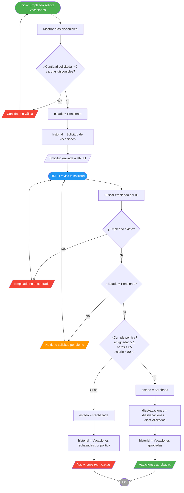
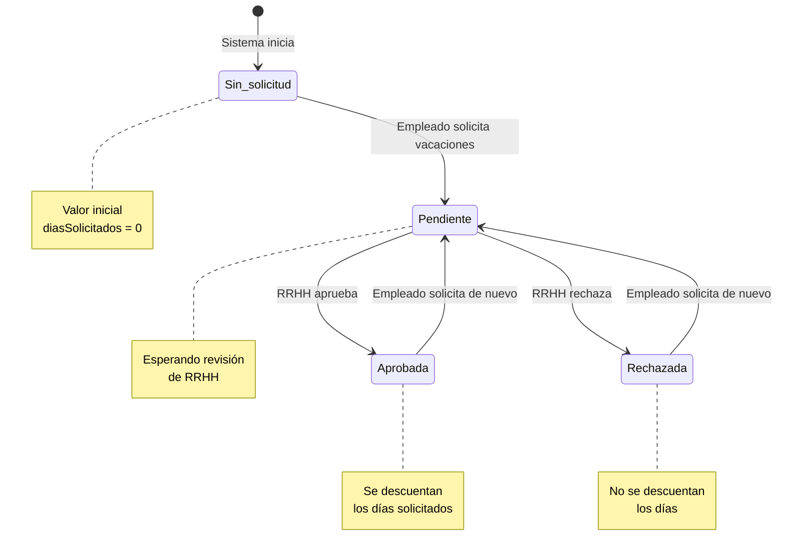
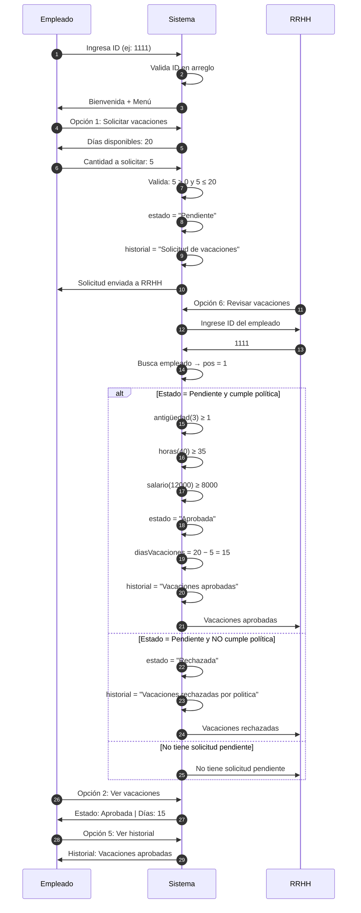
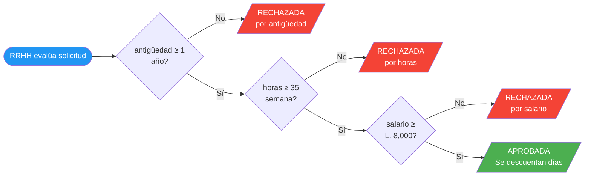

# Diagrama de Flujo — Proceso de Aprobación de Vacaciones

---

## 1. Diagrama de flujo general (Mermaid)



---

## 2. Diagrama de estados de vacaciones (Mermaid)



---

## 3. Diagrama de interacción Empleado ↔ RRHH (Mermaid)



---

## 4. Diagrama de decisión de política (Mermaid)



---

## 5. Ejemplo visual completo

```mermaid
flowchart TD
    subgraph EMPLEADO [" MENÚ EMPLEADO"]
        E1[Empleado 1 - ID: 1111] --> E2[Solicita 5 días de vacaciones]
        E2 --> E3[Estado: Pendiente]
    end

    subgraph RRHH [" MENÚ RRHH"]
        R1[RRHH revisa solicitud] --> R2{Evalúa política}
        R2 -->|Aprueba| R3[Estado: Aprobada]
        R2 -->|Rechaza| R4[Estado: Rechazada]
    end

    E3 --> R1
    R3 --> E5[Empleado consulta → Estado: Aprobada\ndías: 20 → 15]
    R4 --> E6[Empleado consulta → Estado: Rechazada\ndías: 20 (sin cambio)]

    style E1 fill:#4CAF50,color:#fff
    style R3 fill:#4CAF50,color:#fff
    style R4 fill:#f44336,color:#fff
```

---

## 6. Código PSeInt correspondiente

### Bloque de solicitud (Empleado)

```pseint
// Opción 1 del menú empleado
Escribir "Dias disponibles: ", diasVacaciones[pos]
Escribir "Cantidad de dias a solicitar:"
Leer diasSolicitados[pos]

Si diasSolicitados[pos] > 0 Y diasSolicitados[pos] <= diasVacaciones[pos] Entonces
    estado[pos] <- "Pendiente"
    historial[pos] <- "Solicitud de vacaciones"
    Escribir "Solicitud enviada a Recursos Humanos."
SiNo
    Escribir "Cantidad de dias no valida."
FinSi
```

### Bloque de aprobación/rechazo (RRHH)

```pseint
// Opción 6 del menú RRHH
Si pos <> -1 Entonces
    Si estado[pos] = "Pendiente" Entonces
        Si antiguedad[pos] >= 1 Y horas[pos] >= 35 Y salario[pos] >= 8000 Entonces
            estado[pos] <- "Aprobada"
            diasVacaciones[pos] <- diasVacaciones[pos] - diasSolicitados[pos]
            historial[pos] <- "Vacaciones aprobadas"
            Escribir "Vacaciones aprobadas."
        SiNo
            estado[pos] <- "Rechazada"
            historial[pos] <- "Vacaciones rechazadas por politica"
            Escribir "Vacaciones rechazadas por politica de RRHH."
        FinSi
    SiNo
        Escribir "El empleado no tiene una solicitud pendiente."
    FinSi
SiNo
    Escribir "Empleado no encontrado."
FinSi
```

---

## 7. Resumen de criterios

| # | Criterio | Expresión | Ejemplo pasa | Ejemplo no pasa |
|---|---|---|---|---|
| 1 | Antigüedad | `antigüedad ≥ 1` | Empleado 1 (3 años)  | Nuevo empleado (0 años)  |
| 2 | Horas | `horas ≥ 35` | Empleado 1 (40 hrs)  | Empleado a tiempo parcial (30 hrs)  |
| 3 | Salario | `salario ≥ 8000` | Empleado 1 (12000)  | Empleado nuevo (7000)  |

> **Nota:** Los tres criterios deben cumplirse simultáneamente. Si alguno falla, la solicitud es rechazada.
