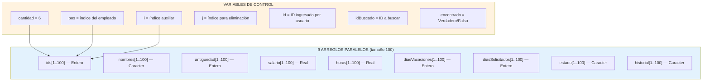
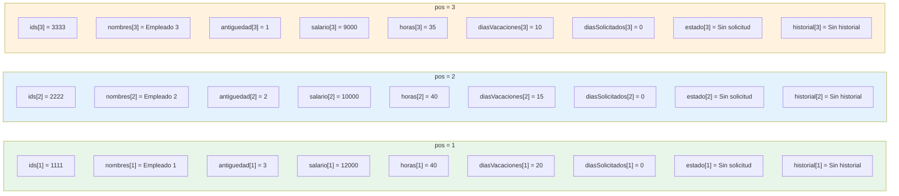
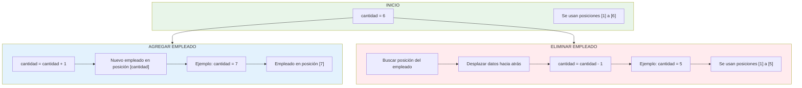
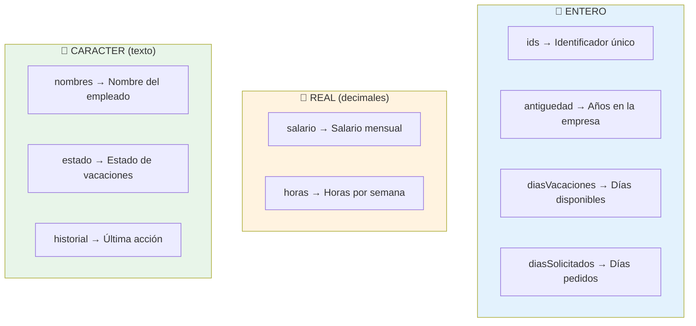
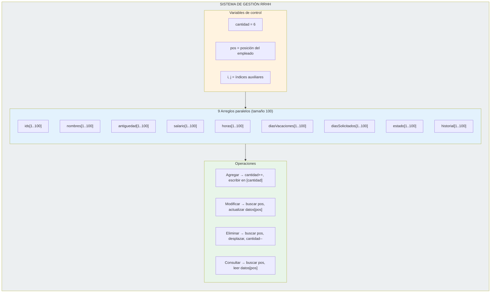

# Diagrama — Estructura de Arreglos del Sistema

---

## 1. Vista general de los arreglos (Mermaid)



---

## 2. Arreglos paralelos — Cada posición = 1 empleado (Mermaid)



---

## 3. Tabla visual de datos iniciales (Mermaid)

```mermaid
flowchart TB
    subgraph HEADER ["TABLA DE EMPLEADOS — Cada fila es un empleado"]
        direction LR
        H1["Índice"]
        H2["ID"]
        H3["Nombre"]
        H4["Antig."]
        H5["Salario"]
        H6["Horas"]
        H7["Vac."]
        H8["Estado"]
        H9["Historial"]
    end

    subgraph F1 [" pos = 1"]
        direction LR
        F1_1["1"]
        F1_2["1111"]
        F1_3["Empleado 1"]
        F1_4["3 años"]
        F1_5["L. 12,000"]
        F1_6["40"]
        F1_7["20 días"]
        F1_8["Sin solicitud"]
        F1_9["Sin historial"]
    end

    subgraph F2 [" pos = 2"]
        direction LR
        F2_1["2"]
        F2_2["2222"]
        F2_3["Empleado 2"]
        F2_4["2 años"]
        F2_5["L. 10,000"]
        F2_6["40"]
        F2_7["15 días"]
        F2_8["Sin solicitud"]
        F2_9["Sin historial"]
    end

    subgraph F3 [" pos = 3"]
        direction LR
        F3_1["3"]
        F3_2["3333"]
        F3_3["Empleado 3"]
        F3_4["1 año"]
        F3_5["L. 9,000"]
        F3_6["35"]
        F3_7["10 días"]
        F3_8["Sin solicitud"]
        F3_9["Sin historial"]
    end

    subgraph F4 [" pos = 4"]
        direction LR
        F4_1["4"]
        F4_2["4444"]
        F4_3["RRHH 1"]
        F4_4["4 años"]
        F4_5["L. 15,000"]
        F4_6["40"]
        F4_7["15 días"]
        F4_8["Sin solicitud"]
        F4_9["Sin historial"]
    end

    subgraph F5 [" pos = 5"]
        direction LR
        F5_1["5"]
        F5_2["5555"]
        F5_3["RRHH 2"]
        F5_4["5 años"]
        F5_5["L. 16,000"]
        F5_6["40"]
        F5_7["15 días"]
        F5_8["Sin solicitud"]
        F5_9["Sin historial"]
    end

    subgraph F6 [" pos = 6"]
        direction LR
        F6_1["6"]
        F6_2["6666"]
        F6_3["Administrador"]
        F6_4["6 años"]
        F6_5["L. 20,000"]
        F6_6["40"]
        F6_7["20 días"]
        F6_8["Sin solicitud"]
        F6_9["Sin historial"]
    end

    subgraph LIBRE [" pos = 7..100"]
        LIBRE_TXT["VACÍO — disponible para nuevos empleados"]
    end

    HEADER --> F1
    F1 --> F2
    F2 --> F3
    F3 --> F4
    F4 --> F5
    F5 --> F6
    F6 --> LIBRE

    style HEADER fill:#37474F,color:#fff
    style F1 fill:#E8F5E9
    style F2 fill:#E3F2FD
    style F3 fill:#FFF3E0
    style F4 fill:#F3E5F5
    style F5 fill:#F3E5F5
    style F6 fill:#FFEBEE
    style LIBRE fill:#ECEFF1
```



---

## 4. Cómo funciona `pos` — Acceso por posición (Mermaid)

```mermaid
flowchart TD
    START([Usuario ingresa ID]) --> SEARCH[Recorrer arreglo ids\nPara i ← 1 Hasta cantidad]

    SEARCH --> CHECK{ids[i] = id?}

    CHECK -- "No (i++)" --> NEXT[i = i + 1]
    NEXT --> SEARCH

    CHECK -- "Sí" --> FOUND[pos = i]

    FOUND --> ACCESS[Acceder a todos los arreglos\nusando pos]

    ACCESS --> A1["ids[pos]"]
    ACCESS --> A2["nombres[pos]"]
    ACCESS --> A3["antiguedad[pos]"]
    ACCESS --> A4["salario[pos]"]
    ACCESS --> A5["horas[pos]"]
    ACCESS --> A6["diasVacaciones[pos]"]
    ACCESS --> A7["diasSolicitados[pos]"]
    ACCESS --> A8["estado[pos]"]
    ACCESS --> A9["historial[pos]"]

    style START fill:#4CAF50,color:#fff
    style FOUND fill:#2196F3,color:#fff
    style ACCESS fill:#FFF3E0
```

### Ejemplo: Buscar ID 3333

```
i = 1 → ids[1] = 1111 ≠ 3333 → siguiente
i = 2 → ids[2] = 2222 ≠ 3333 → siguiente
i = 3 → ids[3] = 3333 = 3333 → ¡ENCONTRADO! → pos = 3

Ahora se puede acceder:
  nombres[3] = "Empleado 3"
  salario[3] = 9000
  horas[3] = 35
  ...
```

---

## 5. Cómo funciona `cantidad` — Control de empleados (Mermaid)



### Ejemplo: Agregar empleado

```
ANTES:  cantidad = 6, posiciones usadas = [1] a [6]
AGREGAR: cantidad = 7, nuevo empleado en [7]
DESPUÉS: cantidad = 7, posiciones usadas = [1] a [7]
```

### Ejemplo: Eliminar empleado en posición 2

```
ANTES (cantidad = 6):
  [1] = Empleado 1 (1111)
  [2] = Empleado 2 (2222)  ← SE ELIMINA
  [3] = Empleado 3 (3333)
  [4] = RRHH 1 (4444)
  [5] = RRHH 2 (5555)
  [6] = Administrador (6666)

DESPUÉS (cantidad = 5):
  [1] = Empleado 1 (1111)
  [2] = Empleado 3 (3333)  ← se movió de [3] a [2]
  [3] = RRHH 1 (4444)      ← se movió de [4] a [3]
  [4] = RRHH 2 (5555)      ← se movió de [5] a [4]
  [5] = Administrador (6666) ← se movió de [6] a [5]
```

---

## 6. Desplazamiento al eliminar (Mermaid)

```mermaid
flowchart LR
    subgraph ANTES ["ANTES (cantidad = 6)"]
        direction TB
        A1["[1] Empleado 1"]
        A2["[2] Empleado 2 "]
        A3["[3] Empleado 3"]
        A4["[4] RRHH 1"]
        A5["[5] RRHH 2"]
        A6["[6] Administrador"]
    end

    subgraph PROCESO ["PROCESO DE DESPLAZAMIENTO"]
        direction TB
        P1["j = 2: [2] ← [3]"]
        P2["j = 3: [3] ← [4]"]
        P3["j = 4: [4] ← [5]"]
        P4["j = 5: [5] ← [6]"]
        P5["cantidad = 5"]
    end

    subgraph DESPUES ["DESPUÉS (cantidad = 5)"]
        direction TB
        D1["[1] Empleado 1"]
        D2["[2] Empleado 3 "]
        D3["[3] RRHH 1 "]
        D4["[4] RRHH 2 "]
        D5["[5] Administrador "]
        DV["[6] VACÍO"]
    end

    ANTES --> PROCESO
    PROCESO --> DESPUES

    style ANTES fill:#FFEBEE
    style PROCESO fill:#FFF3E0
    style DESPUES fill:#E8F5E9
```



---

## 7. Modificación de datos (Mermaid)

```mermaid
flowchart TD
    START([RRHH modifica empleado]) --> READ[Leer ID a modificar]
    READ --> SEARCH[Buscar ID en arreglo]
    SEARCH --> FOUND{¿Encontrado?}

    FOUND -- No --> ERR[/Empleado no encontrado/]

    FOUND -- Sí --> pos2[pos = índice encontrado]

    pos2 --> OLD1["ANTES: nombres[pos] = \"Empleado 3\""]
    pos2 --> OLD2["ANTES: salario[pos] = 9000"]
    pos2 --> OLD3["ANTES: horas[pos] = 35"]

    OLD1 --> NEW1["DESPUÉS: nombres[pos] = \"Maria Lopez\""]
    OLD2 --> NEW2["DESPUÉS: salario[pos] = 14000"]
    OLD3 --> NEW3["DESPUÉS: horas[pos] = 42"]

    NEW1 --> HIST[historial[pos] = "Datos modificados"]
    NEW2 --> HIST
    NEW3 --> HIST

    HIST --> DONE[/Empleado modificado/]

    style START fill:#9C27B0,color:#fff
    style DONE fill:#4CAF50,color:#fff
    style ERR fill:#f44336,color:#fff
```

---

## 8. Tipos de datos de cada arreglo (Mermaid)



---

## 9. Resumen visual completo



---

## 10. Código PSeInt de declaración

```pseint
// BLOQUE 1: DECLARACIÓN DE VARIABLES Y ARREGLOS

// Variables de control
Definir cantidad, i, j, opcion, id, pos, idBuscado Como Entero
Definir encontrado Como Logico

// Arreglos de texto
Definir nombres, estado, historial Como Caracter

// Arreglos numéricos
Definir ids, antiguedad, diasVacaciones, diasSolicitados Como Entero
Definir horas, salario Como Real

// Dimensionamiento (tamaño máximo 100)
Dimension nombres[100], estado[100], historial[100]
Dimension ids[100], antiguedad[100], diasVacaciones[100], diasSolicitados[100]
Dimension horas[100], salario[100]
```
