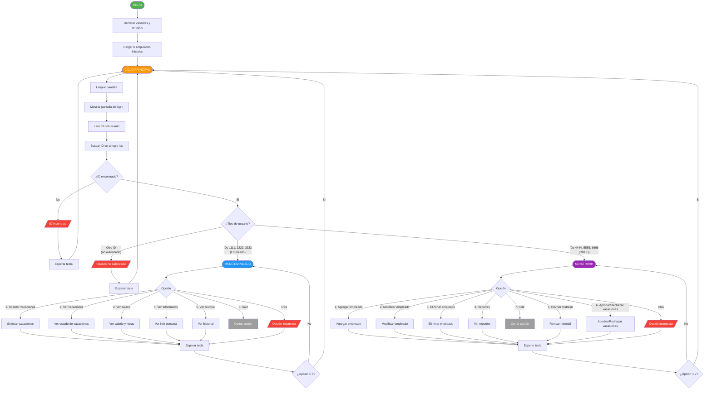
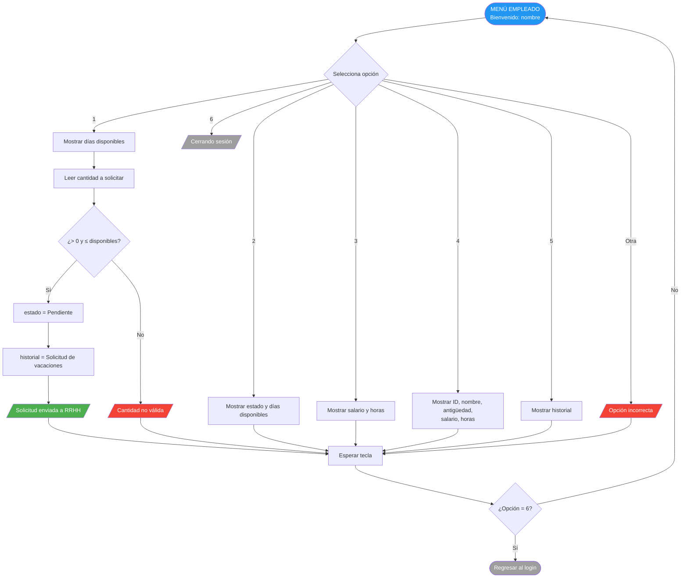
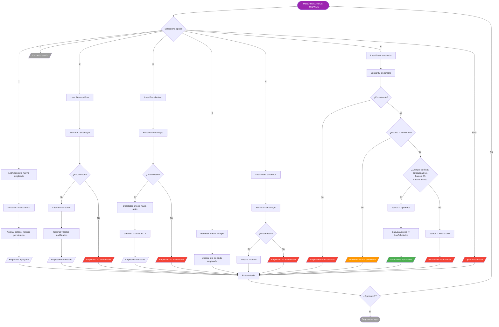
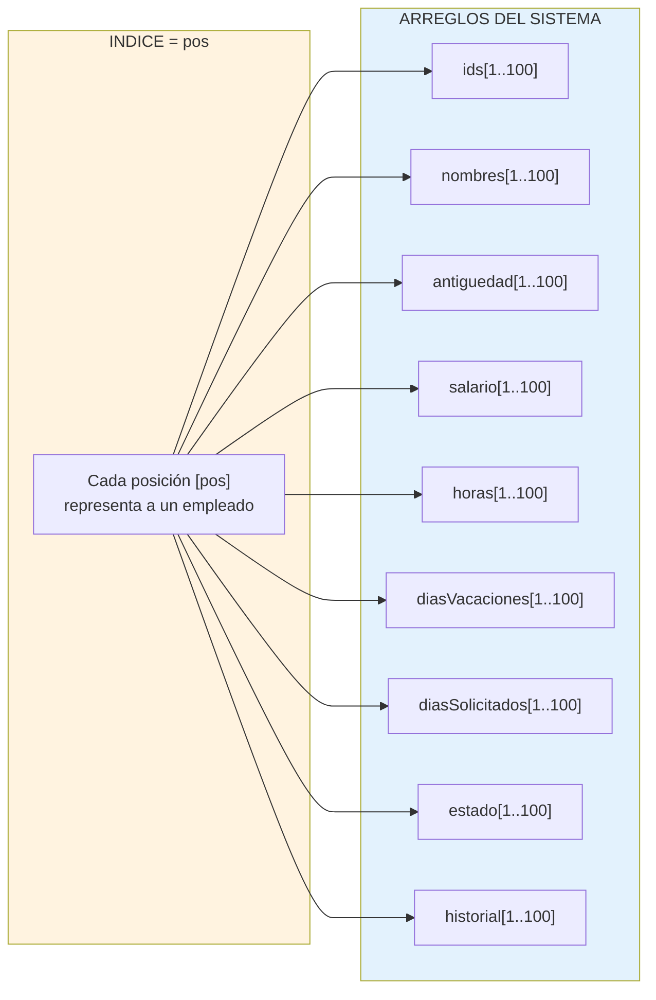
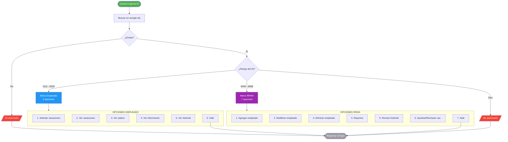

# Diagrama de Flujo General — Sistema de Gestión RRHH

---

## 1. Flujo principal del sistema (Mermaid)

---

## 2. Detalle del menú de Empleado (Mermaid)

---

## 3. Detalle del menú de RRHH (Mermaid)

---

## 4. Diagrama de secuencia completo (Mermaid)

```mermaid
sequenceDiagram
    autonumber
    participant U as  Usuario
    participant S as  Sistema
    participant DB as  Arreglos

    Note over S, DB: INICIALIZACIÓN
    S->>DB: Declarar variables y arreglos [100]
    S->>DB: Cargar 6 empleados iniciales
    S->>DB: Asignar estado, historial por defecto

    loop Ciclo principal (infinito)
        Note over U, DB: LOGIN
        U->>S: Ingresar ID
        S->>DB: Buscar ID en arreglo ids[]
        DB-->>S: pos (índice o -1)

        alt ID no encontrado
            S->>U:  ID incorrecto
        else ID válido
            alt IDs 1111, 2222, 3333 (Empleado)
                loop Menú Empleado (hasta opción 6)
                    U->>S: Seleccionar opción
                    alt Opción 1: Solicitar vacaciones
                        S->>DB: Leer días disponibles
                        DB-->>S: diasVacaciones[pos]
                        U->>S: Cantidad a solicitar
                        alt Válido (> 0 y ≤ disponibles)
                            S->>DB: estado[pos] = "Pendiente"
                            S->>DB: historial[pos] = "Solicitud de vacaciones"
                            S->>U:  Solicitud enviada a RRHH
                        else Inválido
                            S->>U:  Cantidad no válida
                        end
                    else Opción 2: Ver vacaciones
                        S->>DB: Leer estado y días
                        DB-->>S: estado, diasVacaciones
                        S->>U: Mostrar información
                    else Opción 3: Ver salario
                        S->>DB: Leer salario y horas
                        DB-->>S: salario, horas
                        S->>U: Mostrar salario y horas
                    else Opción 4: Ver información
                        S->>DB: Leer todos los datos
                        DB-->>S: ids, nombres, antigüedad, salario, horas
                        S->>U: Mostrar info completa
                    else Opción 5: Ver historial
                        S->>DB: Leer historial
                        DB-->>S: historial[pos]
                        S->>U: Mostrar historial
                    else Opción 6: Salir
                        S->>U: Cerrando sesión
                    end
                end

            else IDs 4444, 5555, 6666 (RRHH)
                loop Menú RRHH (hasta opción 7)
                    U->>S: Seleccionar opción
                    alt Opción 1: Agregar empleado
                        U->>S: Datos del nuevo empleado
                        S->>DB: cantidad += 1
                        S->>DB: Guardar en posición [cantidad]
                        S->>U:  Empleado agregado
                    else Opción 2: Modificar empleado
                        U->>S: ID a modificar
                        S->>DB: Buscar ID
                        alt Encontrado
                            U->>S: Nuevos datos
                            S->>DB: Actualizar campos
                            S->>U:  Empleado modificado
                        else No encontrado
                            S->>U:  Empleado no encontrado
                        end
                    else Opción 3: Eliminar empleado
                        U->>S: ID a eliminar
                        S->>DB: Buscar ID
                        alt Encontrado
                            S->>DB: Desplazar arreglo
                            S->>DB: cantidad -= 1
                            S->>U:  Empleado eliminado
                        else No encontrado
                            S->>U:  Empleado no encontrado
                        end
                    else Opción 4: Reportes
                        S->>DB: Recorrer todo el arreglo
                        DB-->>S: Info de todos los empleados
                        S->>U: Mostrar reportes
                    else Opción 5: Revisar historial
                        U->>S: ID del empleado
                        S->>DB: Buscar ID
                        DB-->>S: historial[pos]
                        S->>U: Mostrar historial
                    else Opción 6: Aprobar/Rechazar vacaciones
                        U->>S: ID del empleado
                        S->>DB: Buscar ID
                        alt Encontrado y Pendiente
                            S->>S: Evaluar política
                            alt Cumple (antigüedad ≥ 1, horas ≥ 35, salario ≥ 8000)
                                S->>DB: estado = "Aprobada"
                                S->>DB: diasVacaciones -= diasSolicitados
                                S->>DB: historial = "Vacaciones aprobadas"
                                S->>U:  Vacaciones aprobadas
                            else No cumple
                                S->>DB: estado = "Rechazada"
                                S->>DB: historial = "Rechazadas por politica"
                                S->>U:  Vacaciones rechazadas
                            end
                        else Sin solicitud o no encontrado
                            S->>U: Mensaje informativo
                        end
                    else Opción 7: Salir
                        S->>U: Cerrando sesión
                    end
                end

            else Otro ID
                S->>U:  Usuario no autorizado
            end
        end
    end
```

---

## 5. Diagrama de datos — Estructura de arreglos (Mermaid)

---

## 6. Diagrama de acceso por ID (Mermaid)

---

## 7. Leyenda de colores

| Color | Significado |
|---|---|
|  Verde | Inicio / Éxito / Aprobado |
|  Azul | Menú de Empleado |
|  Morado | Menú de RRHH |
|  Naranja | Ciclo principal / Advertencia |
|  Gris | Salir / Cerrar sesión |
|  Rojo | Error / Rechazado / No encontrado |
